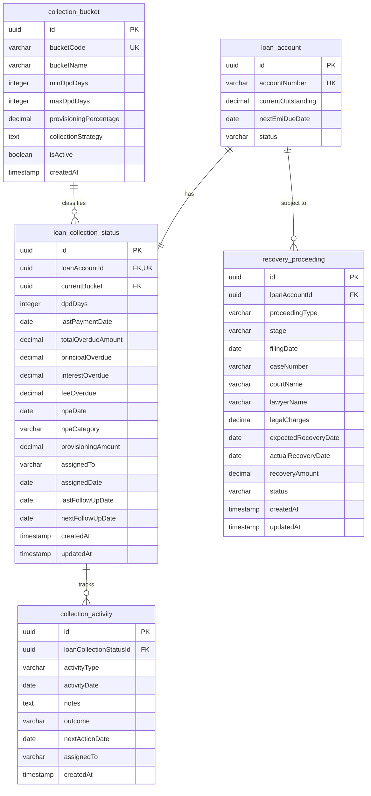

### Collections Module ERD

**Key Relationships:**
- **loan_account → loan_collection_status**: One-to-One (1:1) - Each loan has one collection status
- **collection_bucket → loan_collection_status**: Many-to-One (N:1) - Multiple loans in one bucket
- **loan_collection_status → collection_activity**: One-to-Many (1:N) - Each status tracks multiple activities
- **loan_account → recovery_proceeding**: One-to-Many (1:N) - Each loan can have multiple legal proceedings
