### Comprehensive LMS ERD

```mermaid
erDiagram
    %% Core Tables
    loan_account ||--o{ emi_schedule : "has"
    loan_account ||--o{ repayment : "receives"
    loan_account ||--o{ disbursement : "disbursed via"

    %% Collections Tables
    loan_account ||--|| loan_collection_status : "has"
    collection_bucket ||--o{ loan_collection_status : "classifies"
    loan_collection_status ||--o{ collection_activity : "tracks"
    loan_account ||--o{ recovery_proceeding : "subject to"

    %% Fees Tables
    fee_master ||--o{ loan_fees : "defines"
    loan_account ||--o{ loan_fees : "charged"
    loan_fees ||--o{ fee_payment : "paid via"
    emi_schedule ||--o{ penalty_calculation : "incurs"

    %% Interest Tables
    loan_account ||--o{ interest_accrual : "accrues"
    loan_account ||--o{ interest_rate_history : "tracks"

    %% Modifications Tables
    loan_account ||--o{ loan_restructuring : "undergoes"
    loan_restructuring ||--|| restructuring_terms : "defines"
    loan_account ||--o{ interest_rate_adjustment : "adjusted"
    loan_account ||--o{ tenure_change : "modified"
    loan_account ||--o{ top_up_loan : "enhanced by"

    %% CORE
    loan_account {
        uuid id PK
        uuid loanApplicationId FK,UK
        uuid loanSanctionId FK
        varchar accountNumber UK
        decimal principalAmount
        decimal currentOutstanding
        decimal interestRate
        integer tenureMonths
        timestamp loanStartDate
        timestamp loanEndDate
        date nextEmiDueDate
        varchar status
        decimal totalCollateralValue
        decimal currentLtv
    }

    emi_schedule {
        uuid id PK
        uuid loanApplicationId FK
        uuid loanSanctionId FK
        integer installmentNumber
        date dueDate
        decimal principalAmount
        decimal interestAmount
        decimal totalEmiAmount
        decimal openingPrincipal
        decimal closingPrincipal
        varchar status
        timestamp paidDate
        decimal paidAmount
        integer overdueDays
        decimal latePaymentCharges
    }

    repayment {
        uuid id PK
        uuid loanApplicationId FK
        uuid emiScheduleId FK
        decimal paymentAmount
        timestamp paymentDate
        varchar paymentMode
        decimal principalComponent
        decimal interestComponent
        decimal latePaymentCharges
        varchar transactionReference
        varchar utrNumber
        varchar allocatedToEmiNumbers
        boolean foreclosurePayment
    }

    disbursement {
        uuid id PK
        uuid loanApplicationId FK
        uuid loanSanctionId FK
        decimal disbursementAmount
        timestamp disbursementDate
        varchar status
        varchar beneficiaryAccountNumber
        varchar beneficiaryIfsc
        varchar utrNumber
        varchar transactionReference
    }

    %% COLLECTIONS
    loan_collection_status {
        uuid id PK
        uuid loanAccountId FK,UK
        uuid currentBucket FK
        integer dpdDays
        date lastPaymentDate
        decimal totalOverdueAmount
        decimal principalOverdue
        decimal interestOverdue
        decimal feeOverdue
        date npaDate
        varchar npaCategory
        decimal provisioningAmount
        varchar assignedTo
        date nextFollowUpDate
    }

    collection_bucket {
        uuid id PK
        varchar bucketCode UK
        varchar bucketName
        integer minDpdDays
        integer maxDpdDays
        decimal provisioningPercentage
        text collectionStrategy
        boolean isActive
    }

    collection_activity {
        uuid id PK
        uuid loanCollectionStatusId FK
        varchar activityType
        date activityDate
        text notes
        varchar outcome
        date nextActionDate
        varchar assignedTo
    }

    recovery_proceeding {
        uuid id PK
        uuid loanAccountId FK
        varchar proceedingType
        varchar stage
        date filingDate
        varchar caseNumber
        varchar courtName
        decimal legalCharges
        date expectedRecoveryDate
        decimal recoveryAmount
        varchar status
    }

    %% FEES
    fee_master {
        uuid id PK
        varchar feeCode UK
        varchar feeName
        varchar feeType
        varchar calculationMethod
        decimal rate
        decimal fixedAmount
        varchar applicability
        varchar glHead
        boolean isActive
        date effectiveDate
    }

    loan_fees {
        uuid id PK
        uuid loanAccountId FK
        uuid feeId FK
        decimal feeAmount
        decimal waivedAmount
        decimal paidAmount
        decimal outstandingAmount
        date applicableDate
        date dueDate
        varchar status
        varchar waivedBy
        text waivedReason
    }

    fee_payment {
        uuid id PK
        uuid loanFeeId FK
        decimal paymentAmount
        date paymentDate
        varchar paymentMode
        varchar transactionReference
        varchar utrNumber
    }

    penalty_calculation {
        uuid id PK
        uuid emiScheduleId FK
        integer overdueDays
        decimal penaltyAmount
        date calculatedDate
        boolean waived
        varchar waivedBy
        text waivedReason
    }

    %% INTEREST
    interest_accrual {
        uuid id PK
        uuid loanAccountId FK
        date accrualDate
        decimal principalOutstanding
        decimal interestRate
        integer daysInPeriod
        decimal accruedInterest
        boolean postedToLedger
    }

    interest_rate_history {
        uuid id PK
        uuid loanAccountId FK
        date effectiveDate
        decimal oldRate
        decimal newRate
        text reason
        varchar changedBy
    }

    %% MODIFICATIONS
    loan_restructuring {
        uuid id PK
        uuid loanAccountId FK
        varchar restructuringType
        date requestedDate
        date effectiveDate
        date approvedDate
        varchar approvedBy
        text reason
        varchar status
    }

    restructuring_terms {
        uuid id PK
        uuid loanRestructuringId FK,UK
        integer oldTenure
        integer newTenure
        decimal oldInterestRate
        decimal newInterestRate
        decimal oldEmiAmount
        decimal newEmiAmount
        integer moratoriumPeriod
        text moratoriumReason
        decimal restructuringCharges
    }

    interest_rate_adjustment {
        uuid id PK
        uuid loanAccountId FK
        date effectiveFrom
        decimal previousRate
        decimal newRate
        varchar adjustmentReason
        varchar approvedBy
        boolean linkedToRestructuring
    }

    tenure_change {
        uuid id PK
        uuid loanAccountId FK
        integer oldTenureMonths
        integer newTenureMonths
        date effectiveDate
        text reason
        decimal impactOnEmi
        varchar approvedBy
    }

    top_up_loan {
        uuid id PK
        uuid parentLoanAccountId FK
        decimal topUpAmount
        decimal newTotalLoan
        integer newTenure
        decimal newInterestRate
        date approvedDate
        date disbursedDate
        varchar status
    }
```

## LMS Schema Overview

**Total Tables: 20**

### Module Breakdown:
1. **Core (4 tables)**: loan_account, emi_schedule, repayment, disbursement
2. **Collections (4 tables)**: loan_collection_status, collection_bucket, collection_activity, recovery_proceeding
3. **Fees (4 tables)**: fee_master, loan_fees, fee_payment, penalty_calculation
4. **Interest (2 tables)**: interest_accrual, interest_rate_history
5. **Modifications (6 tables)**: loan_restructuring, restructuring_terms, interest_rate_adjustment, tenure_change, top_up_loan

### Central Hub:
**loan_account** is the central table with relationships to:
- 1 collection status (1:1)
- N EMI schedules (1:N)
- N repayments (1:N)
- N disbursements (1:N)
- N fee records (1:N)
- N daily interest accruals (1:N)
- N rate history entries (1:N)
- N restructurings (1:N)
- N rate adjustments (1:N)
- N tenure changes (1:N)
- N top-ups (1:N)
- N recovery proceedings (1:N)
