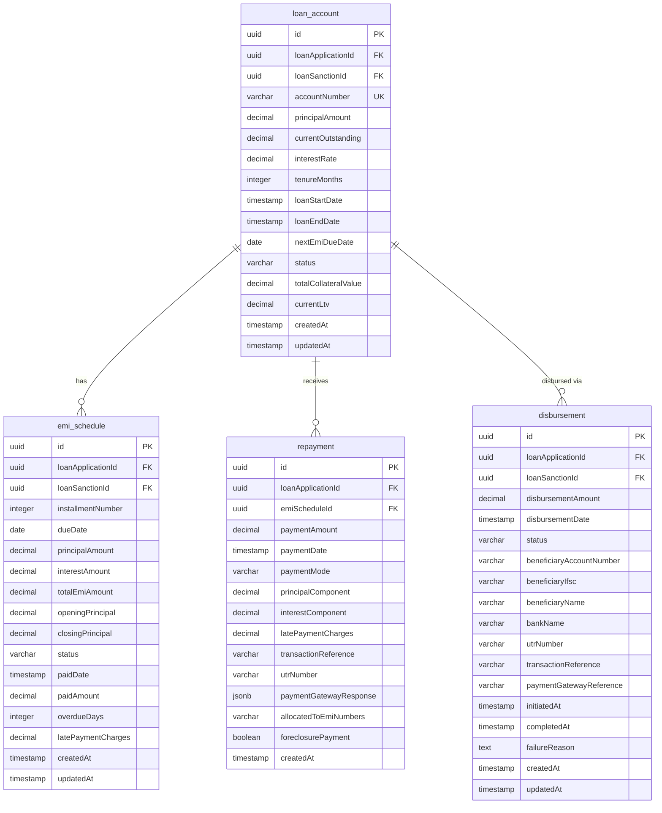

### Core Module ERD

**Key Relationships:**
- **loan_account → emi_schedule**: One-to-Many (1:N) - Each loan has multiple EMI schedules
- **loan_account → repayment**: One-to-Many (1:N) - Each loan receives multiple repayments
- **loan_account → disbursement**: One-to-Many (1:N) - Each loan can have multiple disbursements
- **repayment → emi_schedule**: Many-to-One (N:1) - Repayments are allocated to specific EMI schedules
