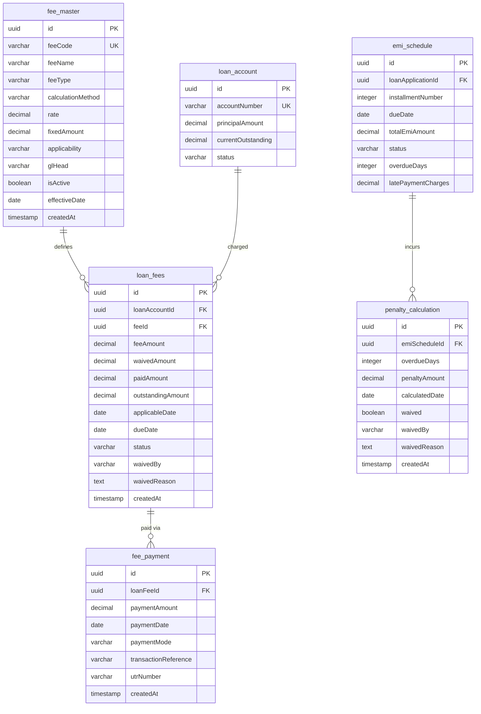

### Fees Module ERD

**Key Relationships:**
- **fee_master → loan_fees**: One-to-Many (1:N) - Each fee type can be applied to multiple loans
- **loan_account → loan_fees**: One-to-Many (1:N) - Each loan can have multiple types of fees
- **loan_fees → fee_payment**: One-to-Many (1:N) - Each fee can have multiple partial payments
- **emi_schedule → penalty_calculation**: One-to-Many (1:N) - Each EMI can have multiple penalty calculations
