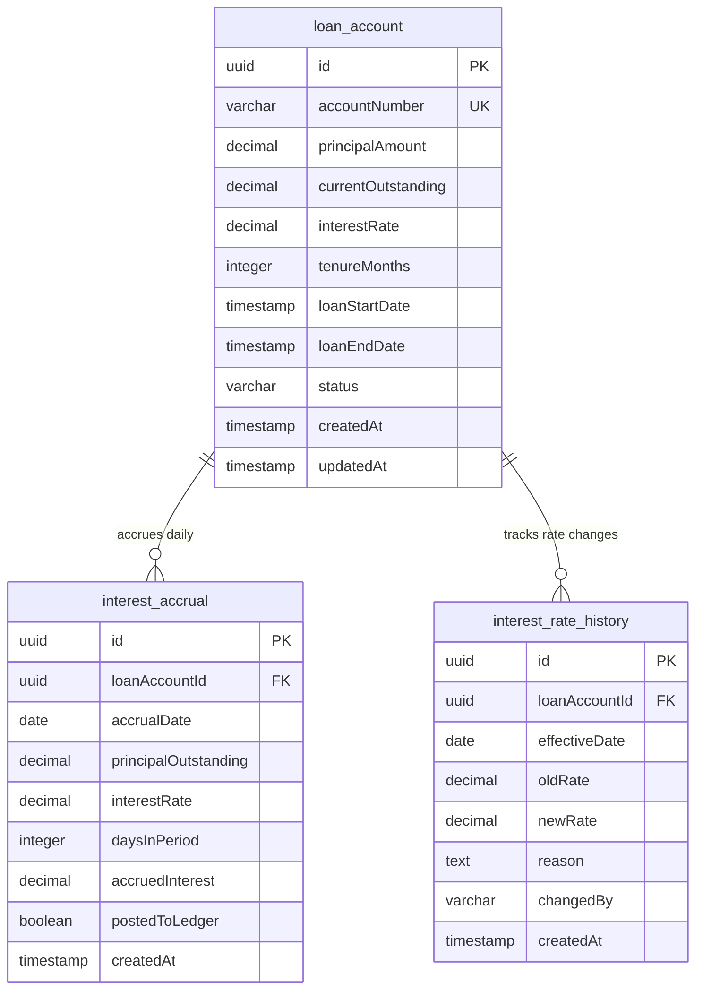

### Interest Module ERD

**Key Relationships:**
- **loan_account → interest_accrual**: One-to-Many (1:N) - Each loan accrues interest daily
  - Indexed on: loanAccountId, accrualDate
  - Tracks daily interest calculations
  - Links to ledger posting status

- **loan_account → interest_rate_history**: One-to-Many (1:N) - Each loan tracks all rate changes
  - Indexed on: loanAccountId, effectiveDate
  - Maintains audit trail of rate modifications
  - Stores reason and approver for each change

**Key Features:**
- **Daily Accrual**: interest_accrual table grows daily for each active loan
- **Rate Tracking**: Complete history of interest rate changes with reasons
- **Ledger Integration**: postedToLedger flag tracks posting to accounting system
