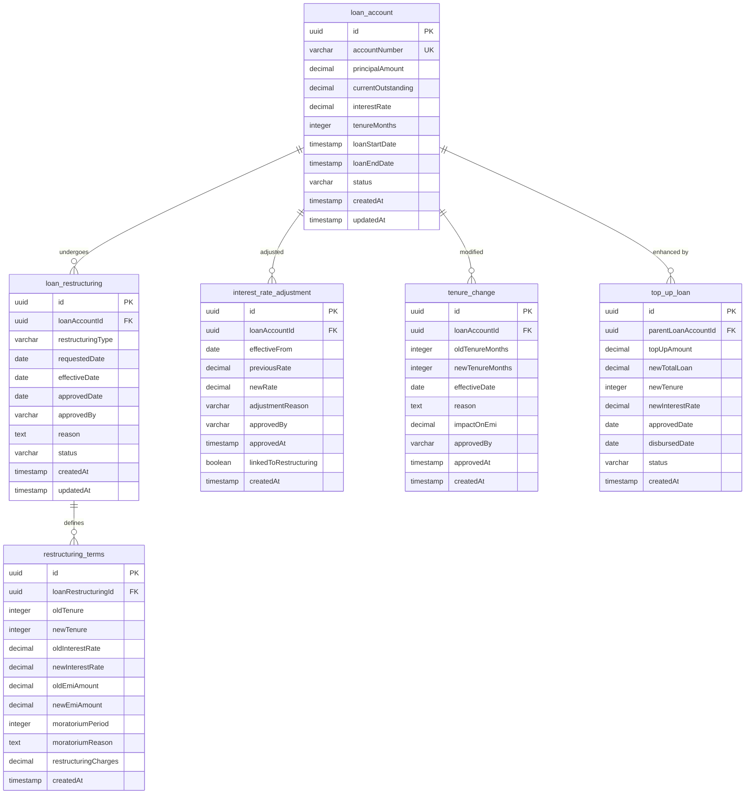

### Modifications Module ERD

**Key Relationships:**
- **loan_account → loan_restructuring**: One-to-Many (1:N) - Each loan can be restructured multiple times
- **loan_restructuring → restructuring_terms**: One-to-One (1:1) - Each restructuring has detailed terms
- **loan_account → interest_rate_adjustment**: One-to-Many (1:N) - Each loan can have multiple rate adjustments
- **loan_account → tenure_change**: One-to-Many (1:N) - Each loan can have multiple tenure changes
- **loan_account → top_up_loan**: One-to-Many (1:N) - Each loan can have multiple top-ups

**Modification Types:**
1. **Restructuring**: Comprehensive changes (tenure + rate + EMI + moratorium)
2. **Rate Adjustment**: Standalone interest rate changes
3. **Tenure Change**: Standalone tenure modifications
4. **Top-up**: Additional lending with new terms
