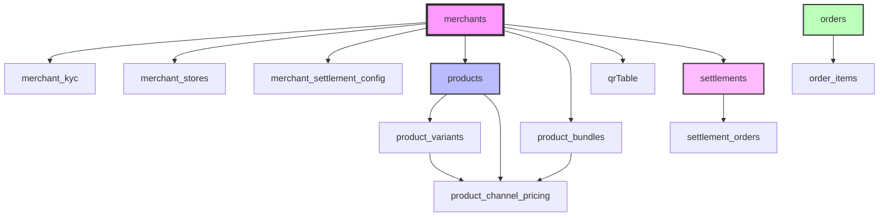

# Entity Relationship Diagram (ERD)

This document contains the Mermaid ERD diagram for the merchant schema.

## Complete Merchant Schema ERD

```mermaid
erDiagram
    %% Users Schema
    users ||--o{ orders : places

    %% Merchant Domain
    merchants ||--|| merchant_kyc : has
    merchants ||--|| merchant_settlement_config : has
    merchants ||--o{ merchant_stores : operates
    merchants ||--o{ merchant_emi_plans : offers
    merchants ||--o{ merchant_variant_emi_plans : offers
    merchants ||--o{ products : sells
    merchants ||--o{ product_bundles : creates
    merchants ||--o{ qrTable : generates
    merchants ||--o{ orders : receives
    merchants ||--o{ settlements : receives
    merchants ||--o{ merchant_analytics_daily : tracks
    merchants ||--o{ merchant_analytics_raw : tracks

    %% Product Domain
    merchant_categories ||--o{ products : categorizes
    products ||--o{ product_variants : has
    products ||--o{ product_channel_pricing : has
    product_variants ||--o{ product_channel_pricing : has
    product_bundles ||--o{ product_channel_pricing : has

    %% Order Domain
    orders ||--o{ order_items : contains
    merchant_stores ||--o{ orders : fulfills
    products ||--o{ order_items : ordered
    product_variants ||--o{ order_items : ordered
    product_bundles ||--o{ order_items : ordered

    %% Settlement Domain
    settlements ||--o{ settlement_orders : contains
    orders ||--o{ settlement_orders : settled_in

    %% Analytics Domain
    merchant_stores ||--o{ merchant_analytics_daily : tracks
    merchant_stores ||--o{ merchant_analytics_raw : tracks

    %% QR Domain
    products ||--o{ qrTable : links
    product_variants ||--o{ qrTable : links

    %% Entity Definitions
    merchants {
        uuid id PK
        varchar name
        varchar slug
        text description
        timestamp createdAt
        timestamp updatedAt
        boolean isActive
    }

    merchant_kyc {
        uuid id PK
        uuid merchantId FK
        varchar panNumber
        varchar gstin
        varchar bankAccountNumber
        varchar bankName
        varchar bankBranch
        varchar bankIfsc
        varchar bankAccountHolderName
        varchar bankAccountType
        varchar upiId
        varchar status
        varchar primaryContactName
        varchar primaryContactPhone
        varchar primaryContactEmail
        text address
        varchar city
        varchar state
        varchar pincode
        varchar country
        decimal commissionRate
        varchar logoUrl
        text businessDescription
        timestamp createdAt
        timestamp updatedAt
    }

    merchant_stores {
        uuid id PK
        uuid merchantId FK
        varchar storeName
        varchar storeCode UK
        varchar storeType
        text address
        varchar landmark
        varchar city
        varchar state
        varchar pincode
        varchar country
        varchar gstin
        varchar bankAccountNumber
        varchar bankName
        varchar bankBranch
        varchar bankIfsc
        varchar bankAccountHolderName
        varchar bankAccountType
        varchar upiId
        varchar status
        decimal latitude
        decimal longitude
        integer radiusKm
        varchar phone
        varchar email
        jsonb operatingHours
        boolean isActive
        boolean isDefault
        boolean supportsPickup
        boolean supportsBopis
        decimal commissionRate
        varchar storeManagerName
        varchar storeManagerPhone
        timestamp createdAt
        timestamp updatedAt
    }

    merchant_settlement_config {
        serial id PK
        uuid merchantId FK
        integer settlementCycleDays
        integer settlementDayOfMonth
        varchar settlementBankAccount
        varchar settlementBankIfsc
        varchar settlementBankAccountName
        integer reservePercentage
        integer reserveReleaseDays
        decimal minimumSettlementAmount
        boolean autoSettlementEnabled
        timestamp createdAt
        timestamp updatedAt
    }

    merchant_categories {
        uuid id PK
        uuid merchantId
        varchar name
        varchar slug
        text description
        integer level
        text path
        varchar imageUrl
        varchar iconUrl
        boolean isActive
        integer displayOrder
        varchar metaTitle
        text metaDescription
        text metaKeywords
        jsonb attributeTemplate
        timestamp createdAt
        timestamp updatedAt
    }

    products {
        uuid id PK
        uuid merchantId FK
        uuid categoryId FK
        varchar name
        varchar slug
        varchar sku
        varchar barcode
        varchar productType
        varchar shortDescription
        text longDescription
        decimal basePrice
        decimal compareAtPrice
        decimal costPrice
        decimal taxRate
        boolean taxIncluded
        boolean trackInventory
        boolean allowBackorder
        integer lowStockThreshold
        boolean isActive
        boolean isFeatured
        varchar metaTitle
        text metaDescription
        text metaKeywords
        varchar primaryImageUrl
        jsonb additionalImages
        jsonb attributes
        decimal weight
        varchar weightUnit
        decimal length
        decimal width
        decimal height
        varchar dimensionUnit
        jsonb specifications
        timestamp createdAt
        timestamp updatedAt
    }

    product_variants {
        serial id PK
        integer productId FK
        varchar variantSku
        varchar variantName
        varchar barcode
        jsonb attributes
        decimal price
        decimal compareAtPrice
        decimal costPrice
        integer stockAvailable
        integer stockOnOrder
        integer lowStockThreshold
        boolean isActive
        varchar imageUrl
        decimal weight
        varchar weightUnit
        timestamp createdAt
        timestamp updatedAt
    }

    product_bundles {
        serial id PK
        uuid merchantId FK
        varchar name
        varchar slug
        varchar sku
        text description
        decimal bundlePrice
        decimal compareAtPrice
        decimal discountAmount
        decimal discountPercentage
        jsonb components
        boolean isActive
        boolean isAvailable
        varchar primaryImageUrl
        timestamp createdAt
        timestamp updatedAt
    }

    product_channel_pricing {
        serial id PK
        integer productId FK
        integer productVariantId FK
        integer bundleId FK
        varchar channel
        varchar pricingType
        decimal price
        decimal compareAtPrice
        timestamp effectiveFrom
        timestamp effectiveTo
        uuid storeId
        boolean isActive
        timestamp createdAt
        timestamp updatedAt
    }

    orders {
        uuid id PK
        varchar orderNumber UK
        uuid customerId FK
        uuid merchantId FK
        uuid storeId FK
        varchar channel
        varchar fulfillmentType
        varchar status
        varchar paymentStatus
        decimal subtotalAmount
        decimal discountAmount
        decimal taxAmount
        decimal shippingAmount
        decimal totalAmount
        varchar couponCode
        decimal couponDiscount
        varchar paymentMethod
        varchar paymentTransactionId
        varchar paymentGateway
        jsonb deliveryAddress
        jsonb billingAddress
        timestamp expectedDeliveryDate
        timestamp deliveredAt
        uuid pickupStoreId FK
        timestamp pickupScheduledAt
        timestamp pickupCompletedAt
        text customerNotes
        text giftMessage
        boolean isGift
        text internalNotes
        varchar ipAddress
        text userAgent
        varchar source
        varchar utmSource
        varchar utmMedium
        varchar utmCampaign
        uuid loanApplicationId
        timestamp createdAt
        timestamp updatedAt
    }

    order_items {
        uuid id PK
        uuid orderId FK
        uuid productId
        uuid productVariantId
        uuid bundleId
        varchar productName
        varchar productSku
        varchar variantName
        varchar variantSku
        integer quantity
        decimal unitPrice
        decimal totalPrice
        decimal discountAmount
        decimal taxAmount
        decimal finalPrice
        jsonb attributes
        jsonb serviceAddOns
        varchar fulfillmentStatus
        timestamp shippedAt
        timestamp deliveredAt
        timestamp createdAt
    }

    settlements {
        serial id PK
        varchar settlementNumber UK
        uuid merchantId FK
        timestamp settlementPeriodStart
        timestamp settlementPeriodEnd
        integer totalOrders
        integer ordersSettled
        decimal totalSalesAmount
        decimal totalCommission
        decimal totalRefunds
        decimal totalReturns
        decimal totalCancellation
        decimal adjustments
        text adjustmentNotes
        decimal netSettlementAmount
        varchar status
        varchar bankAccountNumber
        varchar bankIfsc
        varchar bankAccountName
        timestamp initiatedAt
        timestamp processedAt
        timestamp completedAt
        varchar utr
        varchar transactionReference
        varchar paymentMethod
        text failureReason
        integer retryCount
        timestamp lastRetryAt
        varchar settlementReportUrl
        varchar invoiceUrl
        text notes
        timestamp createdAt
        timestamp updatedAt
    }

    settlement_orders {
        serial id PK
        integer settlementId FK
        integer orderId FK
        decimal orderAmount
        decimal commissionAmount
        decimal refundAmount
        decimal returnAmount
        decimal cancellationAmount
        decimal netAmount
        timestamp deliveredAt
        timestamp settlementDate
        timestamp createdAt
    }

    merchant_analytics_daily {
        serial id PK
        uuid merchantId FK
        integer storeId
        timestamp date
        varchar period
        integer totalOrders
        decimal totalRevenue
        decimal averageOrderValue
        integer totalItemsSold
        jsonb ordersByChannel
        jsonb ordersByFulfillment
        jsonb revenueByChannel
        integer totalProducts
        integer lowStockProducts
        integer outOfStockProducts
        decimal inventoryValue
        jsonb topSellingProducts
        jsonb fastMovingProducts
        jsonb slowMovingProducts
        integer newCustomers
        integer returningCustomers
        integer totalCustomers
        jsonb customersByCity
        jsonb customersByGender
        jsonb trafficSource
        decimal averageFulfillmentTime
        decimal fulfillmentRate
        decimal returnRate
        decimal cancellationRate
        decimal averageProductRating
        decimal averageServiceRating
        integer totalReviews
        timestamp createdAt
    }

    merchant_analytics_raw {
        uuid id PK
        uuid merchantId
        uuid storeId
        varchar eventType
        varchar eventName
        uuid customerId
        varchar sessionId
        uuid productId
        uuid productVariantId
        uuid categoryId
        uuid orderId
        jsonb eventProperties
        varchar channel
        varchar source
        varchar deviceType
        text userAgent
        varchar ipAddress
        varchar utmSource
        varchar utmMedium
        varchar utmCampaign
        varchar utmTerm
        varchar utmContent
        varchar city
        varchar state
        varchar country
        timestamp occurredAt
        timestamp createdAt
    }

    qrTable {
        serial id PK
        uuid merchantId FK
        varchar qrCode
        varchar journeyType
        decimal amount
        uuid productId FK
        uuid variantId FK
        text qrCodeData
        boolean isActive
        timestamp createdAt
        timestamp updatedAt
    }

    users {
        uuid id PK
        varchar fullName
        integer age
        varchar pan
        varchar pekrn
        varchar mobile
        varchar email
        varchar status
        boolean emailVerified
        boolean mobileVerified
        boolean panVerified
        boolean pekrnVerified
        boolean kycVerified
        timestamp createdAt
        timestamp updatedAt
    }
```

## Legend

### Symbols
- `||--||` - One-to-One relationship
- `||--o{` - One-to-Many relationship
- `||--|{` - One-to-Many (mandatory) relationship
- `PK` - Primary Key
- `FK` - Foreign Key
- `UK` - Unique Key

### Relationship Types
- **Solid line (||--||)**: Mandatory relationship (both sides required)
- **Solid line with circle (||--o{)**: Optional relationship (child can be null)

## Domain Groupings

### Core Entities
- `merchants` - Central entity for all merchant operations
- `users` - Customer entity
- `merchant_categories` - Product categorization

### Product Catalog
- `products` - Master product table
- `product_variants` - Product variants (size, color, etc.)
- `product_bundles` - Product + service bundles
- `product_channel_pricing` - Omnichannel pricing

### Orders & Fulfillment
- `orders` - Order header
- `order_items` - Order line items
- `merchant_stores` - Store locations for fulfillment

### Financial
- `settlements` - Settlement batches
- `settlement_orders` - Order-level settlement details
- `merchant_settlement_config` - Settlement configuration

### Analytics
- `merchant_analytics_daily` - Aggregated daily metrics
- `merchant_analytics_raw` - Raw event data

### Marketing & Tools
- `qrTable` - QR code generation
- `merchant_emi_plans` - EMI plan templates
- `merchant_variant_emi_plans` - Variant-specific EMI plans

## Cascade Deletion Paths

## Notes

1. **Cross-Schema Relationships:**
   - `users` table is in `users` schema
   - All other tables are in `merchant` schema

2. **Soft Delete Pattern:**
   - Use `isActive` flag for soft deletes where applicable
   - Hard delete cascades are defined for data integrity

3. **Index Strategy:**
   - All foreign keys have indexes
   - Frequently queried columns have composite indexes
   - Unique constraints on natural keys (orderNumber, sku, etc.)

4. **JSONB Columns:**
   - Used for flexible, semi-structured data
   - Indexed using GIN indexes for performance
   - Examples: attributes, specifications, eventProperties
