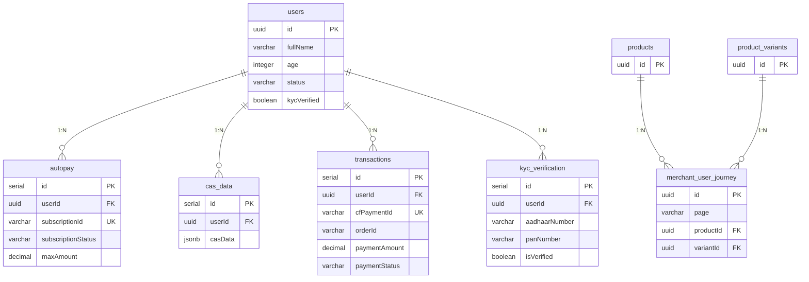

# User Schema Documentation Implementation Plan

> **For Claude:** REQUIRED SUB-SKILL: Use superpowers:executing-plans to implement this plan task-by-task.

**Goal:** Create comprehensive technical documentation for all database schemas in `/src/db/schema/users/` and publish it to the Notion "Database Design and Schema" page.

**Architecture:** This task involves (1) analyzing 6 TypeScript schema files to extract table structures, relationships, and field definitions, (2) creating detailed documentation with table descriptions, field specifications, indexes, and relationships, and (3) publishing the documentation to Notion as a new sub-page under the existing "Database Design and Schema" page.

**Tech Stack:** Drizzle ORM (PostgreSQL), TypeScript, Notion API via MCP

---

## Task 1: Read and Analyze Schema Definitions

**Files:**
- Read: `src/db/schema/definitions.ts`
- Read: `src/db/schema/enums.ts`

**Step 1: Locate schema definitions file**

Run: `cat src/db/schema/definitions.ts`
Expected: View `usersSchema` definition and understand base schema configuration

**Step 2: Locate enums file**

Run: `cat src/db/schema/enums.ts`
Expected: View `userStatusEnum` and other enum definitions referenced in user schemas

**Step 3: Document findings in scratchpad**

Create temporary notes with:
- Schema names (usersSchema, losSchema, merchantSchema)
- All enum values
- Relationship patterns between schemas

---

## Task 2: Extract usersTable Schema Details

**Files:**
- Read: `src/db/schema/users/index.ts`

**Step 1: Parse usersTable structure**

Extract from `index.ts`:
- Table name: `users`
- Primary key: `id` (uuid)
- All fields with types and constraints
- Indexes (none defined)
- Relationships: Referenced by autopay, casData, transactions, kycVerification

**Step 2: Document field specifications**

For each field, document:
- Field name
- Data type (varchar length, integer, boolean, uuid, timestamp)
- Nullability (notNull vs optional)
- Default values
- Validation rules (implied from type)

**Step 3: Create markdown section**

```markdown
### usersTable

**Purpose:** Core user identity and verification status tracking

**Schema:** usersSchema

**Table Name:** `users`

#### Fields

| Field | Type | Constraints | Default | Description |
|-------|------|-------------|---------|-------------|
| id | uuid | PRIMARY KEY | - | Unique user identifier |
| fullName | varchar(255) | NOT NULL | - | User's full legal name |
| age | integer | NOT NULL | - | User's age in years |
| pan | varchar(35) | NULL | - | PAN card number |
| pekrn | varchar(15) | NULL | - | PEKRN number |
| mobile | varchar(13) | NULL | - | Mobile number with country code |
| email | varchar(255) | NULL | - | Email address |
| status | userStatusEnum | NOT NULL | 'pending' | Account status (see enums) |
| emailVerified | boolean | NOT NULL | false | Email verification flag |
| mobileVerified | boolean | NOT NULL | false | Mobile verification flag |
| panVerified | boolean | NOT NULL | false | PAN verification status |
| pekrnVerified | boolean | NOT NULL | false | PEKRN verification status |
| kycVerified | boolean | NOT NULL | false | Complete KYC verification |
| createdAt | timestamp | NOT NULL | now() | Record creation timestamp |
| updatedAt | timestamp | NOT NULL | now() | Last update timestamp |

#### Relationships

**Referenced By:**
- autopayTable (userId)
- casData (userId)
- transactionsTable (userId)
- kycVerificationTable (userId)

#### Indexes

No custom indexes defined (primary key on id only)
```

---

## Task 3: Extract autopayTable Schema Details

**Files:**
- Read: `src/db/schema/users/autopay.ts`

**Step 1: Parse autopayTable structure**

Extract from `autopay.ts`:
- Table name: `autopay`
- Foreign key to usersTable
- Three indexes: userId, subscriptionId, subscriptionStatus
- JSONB fields for flexible data storage

**Step 2: Document field specifications**

Focus on:
- Subscription identifiers (subscriptionId, cfSubscriptionId)
- Status management (subscriptionStatus, planType)
- Timing fields (expiryTime, nextScheduleDate)
- JSONB payload fields (authorizationDetails, customerDetails, etc.)

**Step 3: Create markdown section**

```markdown
### autopayTable

**Purpose:** Manage recurring payment subscriptions and auto-pay mandates

**Schema:** usersSchema

**Table Name:** `autopay`

#### Fields

| Field | Type | Constraints | Default | Description |
|-------|------|-------------|---------|-------------|
| id | serial | PRIMARY KEY | auto | Auto-incrementing ID |
| userId | uuid | FOREIGN KEY, NOT NULL | - | Reference to users.id |
| subscriptionId | varchar(100) | UNIQUE, NOT NULL | - | Internal subscription ID |
| cfSubscriptionId | varchar(100) | NULL | - | Cashfree subscription ID |
| subscriptionSessionId | varchar(255) | NULL | - | Session identifier |
| subscriptionStatus | varchar(50) | NOT NULL | 'INITIALIZED' | Status of subscription |
| planName | varchar(255) | NULL | - | Plan display name |
| planType | varchar(50) | NULL | - | ON_DEMAND or PERIODIC |
| expiryTime | timestamp | NULL | - | Subscription expiry |
| nextScheduleDate | timestamp | NULL | - | Next payment date |
| subscriptionFirstChargeTime | timestamp | NULL | - | First charge timestamp |
| authorizationDetails | jsonb | NULL | - | Auth payload |
| customerDetails | jsonb | NULL | - | Customer information |
| planDetails | jsonb | NULL | - | Plan configuration |
| subscriptionMeta | jsonb | NULL | - | Metadata |
| subscriptionNote | text | NULL | - | Free-form notes |
| subscriptionTags | jsonb | NULL | - | Tag array |
| subscriptionPaymentSplits | jsonb | NULL | - | Payment split config |
| maxAmount | decimal(15,2) | NOT NULL | 0.00 | Maximum debit amount |
| createdAt | timestamp | NOT NULL | now() | Creation timestamp |
| updatedAt | timestamp | NOT NULL | now() | Update timestamp |

#### Relationships

**References:**
- usersTable (userId → id)

#### Indexes

- `autopay_user_id` on userId
- `autopay_sub_id` on subscriptionId
- `autopay_status` on subscriptionStatus
```

---

## Task 4: Extract casData Schema Details

**Files:**
- Read: `src/db/schema/users/casData.ts`

**Step 1: Parse casData structure**

Extract:
- Table name: `cas_data`
- Simple structure with userId + JSONB payload
- Audit timestamps

**Step 2: Document field specifications**

Note: casData is a flexible JSONB store for CAS (Credit Account Switching) data

**Step 3: Create markdown section**

```markdown
### casDataTable

**Purpose:** Store Credit Account Switching (CAS) financial data as flexible JSON

**Schema:** usersSchema

**Table Name:** `cas_data`

#### Fields

| Field | Type | Constraints | Default | Description |
|-------|------|-------------|---------|-------------|
| id | serial | PRIMARY KEY | auto | Auto-incrementing ID |
| userId | uuid | FOREIGN KEY, NOT NULL | - | Reference to users.id |
| casData | jsonb | NOT NULL | - | CAS financial data payload |
| createdAt | timestamp | NOT NULL | now() | Creation timestamp |
| updatedAt | timestamp | NOT NULL | now() | Update timestamp |

#### Relationships

**References:**
- usersTable (userId → id)

#### Indexes

No custom indexes defined (primary key only)

#### Notes

- JSONB structure allows flexible schema for varying CAS data formats
- No indexes on casData - full JSON query performance may be impacted
```

---

## Task 5: Extract kycVerificationTable Schema Details

**Files:**
- Read: `src/db/schema/users/kyc.ts`

**Step 1: Parse kycVerificationTable structure**

Note: This table uses **losSchema** (not usersSchema)

Extract:
- Table name: `kyc_verification`
- Personal identifiers (aadhaar, pan, fullName)
- Verification tracking (isVerified, verificationDate)
- Indexes on userId, aadhaarNumber, panNumber

**Step 2: Document field specifications**

Highlight:
- PII fields (aadhaarNumber, panNumber - both indexed)
- Address stored as JSONB
- Verification workflow fields

**Step 3: Create markdown section**

```markdown
### kycVerificationTable

**Purpose:** Track KYC verification status and documents for loan/financial services

**Schema:** losSchema (Loan Origination System)

**Table Name:** `kyc_verification`

#### Fields

| Field | Type | Constraints | Default | Description |
|-------|------|-------------|---------|-------------|
| id | serial | PRIMARY KEY | auto | Auto-incrementing ID |
| userId | uuid | FOREIGN KEY, NOT NULL | - | Reference to users.id |
| aadhaarNumber | varchar(12) | NULL | - | 12-digit Aadhaar number |
| care_of | varchar(255) | NULL | - | Care_of person |
| panNumber | varchar(10) | NULL | - | 10-character PAN |
| fullName | varchar(255) | NULL | - | Full legal name |
| gender | varchar(10) | NULL | - | Gender (M/F/O/Other) |
| image | varchar(255) | NULL | - | Document image path |
| dateOfBirth | date | NULL | - | Date of birth |
| address | jsonb | NULL | - | Address object |
| isVerified | boolean | NOT NULL | false | KYC completion flag |
| verificationDate | timestamp | NULL | - | When KYC was verified |
| verificationRemarks | text | NULL | - | Verifier notes |
| createdAt | timestamp | NOT NULL | now() | Creation timestamp |
| updatedAt | timestamp | NOT NULL | now() | Update timestamp |

#### Relationships

**References:**
- usersTable (userId → id)

#### Indexes

- `kyc_user` on userId
- `kyc_aadhaar` on aadhaarNumber
- `kyc_pan` on panNumber

#### Security Notes

⚠️ **PII Alert:** Contains indexed sensitive data (aadhaarNumber, panNumber)
- Ensure proper access controls
- Consider encryption at rest
- Audit logging required for queries
```

---

## Task 6: Extract transactionsTable Schema Details

**Files:**
- Read: `src/db/schema/users/transactions.ts`

**Step 1: Parse transactionsTable structure**

Extract:
- Table name: `transactions`
- Payment tracking (amount, status, method)
- Gateway integration (cfPaymentId, paymentGatewayDetails)
- Four indexes for query performance

**Step 2: Document field specifications**

Key areas:
- Payment lifecycle (paymentTime, paymentCompletionTime)
- Integration details (Cashfree IDs, bank references)
- Error tracking (errorDetails)
- Raw response storage (rawResponse JSONB)

**Step 3: Create markdown section**

```markdown
### transactionsTable

**Purpose:** Track all payment transactions through Cashfree gateway

**Schema:** usersSchema

**Table Name:** `transactions`

#### Fields

| Field | Type | Constraints | Default | Description |
|-------|------|-------------|---------|-------------|
| id | serial | PRIMARY KEY | auto | Auto-incrementing ID |
| userId | uuid | FOREIGN KEY, NOT NULL | - | Reference to users.id |
| cfPaymentId | varchar(100) | UNIQUE | - | Cashfree payment ID |
| orderId | varchar(100) | NOT NULL | - | Order identifier |
| entity | varchar(50) | NULL | 'payment' | Entity type |
| paymentAmount | decimal(15,2) | NOT NULL | - | Amount in currency |
| paymentCurrency | varchar(10) | NULL | 'INR' | Currency code |
| paymentStatus | varchar(50) | NOT NULL | - | Status enum |
| paymentMessage | text | NULL | - | Status message |
| paymentTime | timestamp | NULL | - | Payment initiated |
| paymentCompletionTime | timestamp | NULL | - | Payment completed |
| paymentGroup | varchar(50) | NULL | - | Payment grouping |
| paymentMethod | jsonb | NULL | - | Method details |
| authorization | jsonb | NULL | - | Auth payload |
| authId | varchar(100) | NULL | - | Auth identifier |
| paymentGatewayDetails | jsonb | NULL | - | Gateway response |
| bankReference | varchar(100) | NULL | - | Bank ref number |
| errorDetails | jsonb | NULL | - | Error payload |
| isCaptured | varchar(50) | NULL | 'false' | Capture flag |
| rawResponse | jsonb | NULL | - | Full gateway response |
| createdAt | timestamp | NOT NULL | now() | Creation timestamp |
| updatedAt | timestamp | NOT NULL | now() | Update timestamp |

#### Relationships

**References:**
- usersTable (userId → id)

#### Indexes

- `txn_user_id` on userId
- `txn_order_id` on orderId
- `txn_cf_payment_id` on cfPaymentId
- `txn_status` on paymentStatus

#### Integration Notes

- Integrated with Cashfree payment gateway
- rawResponse stores complete gateway payload for reconciliation
- isCaptured uses varchar (not boolean) for legacy compatibility
```

---

## Task 7: Extract userJourney Schema Details

**Files:**
- Read: `src/db/schema/users/userJourney.ts`

**Step 1: Parse userJourney structure**

Note: This table uses **merchantSchema** (not usersSchema)

Extract:
- Table name: `merchant_user_journey`
- UUID primary key
- Foreign keys to products and variants tables
- Four indexes including time-based

**Step 2: Document field specifications**

This is an analytics/audit trail table tracking user product interactions

**Step 3: Create markdown section**

```markdown
### userJourneyTable

**Purpose:** Track user page visits and product interactions for analytics

**Schema:** merchantSchema

**Table Name:** `merchant_user_journey`

#### Fields

| Field | Type | Constraints | Default | Description |
|-------|------|-------------|---------|-------------|
| id | uuid | PRIMARY KEY | - | Journey event ID |
| page | varchar(255) | NOT NULL | - | Page visited |
| productId | uuid | FOREIGN KEY, NOT NULL | - | Product viewed |
| variantId | uuid | FOREIGN KEY, NOT NULL | - | Product variant |
| createdAt | timestamp | NOT NULL | now() | Event timestamp |
| updatedAt | timestamp | NOT NULL | now() | Update timestamp |

#### Relationships

**References:**
- productsTable (productId → id, CASCADE delete)
- productVariantsTable (variantId → id, CASCADE delete)

#### Indexes

- `user_journey_page` on page
- `user_journey_product` on productId
- `user_journey_variant` on variantId
- `user_journey_created` on createdAt

#### Usage Notes

- High-volume analytics table
- Cascade deletes ensure data consistency when products removed
- createdAt index supports time-based analytics queries
- Consider partitioning by date for large-scale deployments
```

---

## Task 8: Create Relationship Diagram Documentation

**Files:**
- Create: `/tmp/schema-relationships.txt` (scratchpad)

**Step 1: Map all foreign key relationships**

Document relationships:
```
usersTable (usersSchema)
  ↓ 1:N
  ├──→ autopayTable.userId
  ├──→ casData.userId
  ├──→ transactionsTable.userId
  └──→ kycVerificationTable.userId (losSchema)

productsTable (merchantSchema)
  ↓ 1:N
  └──→ userJourneyTable.productId (CASCADE)

productVariantsTable (merchantSchema)
  ↓ 1:N
  └──→ userJourneyTable.variantId (CASCADE)
```

**Step 2: Create mermaid diagram syntax**

```markdown
### Schema Relationships


```

---

## Task 9: Create Enum Reference Documentation

**Files:**
- Read: `src/db/schema/enums.ts`

**Step 1: Extract all enum definitions**

Extract userStatusEnum and any other enums used in user schemas

**Step 2: Document enum values**

```markdown
### Enum Definitions

#### userStatusEnum

Used in: `usersTable.status`

**Possible Values:**
- `pending` - Initial state, verification incomplete
- `active` - Fully verified and active
- `suspended` - Account temporarily suspended
- `blocked` - Account permanently blocked
- `deleted` - Soft-deleted account

**Default:** `pending`

**Database Constraints:** NOT NULL
```

---

## Task 10: Compile Complete Documentation

**Files:**
- Create: `docs/user-schema-documentation.md`

**Step 1: Combine all sections into single document**

Create comprehensive markdown file with:
1. Overview section explaining users schema domain
2. Table-by-table documentation (Tasks 2-7)
3. Relationship diagram (Task 8)
4. Enum reference (Task 9)
5. Index summary table
6. Schema organization (usersSchema vs losSchema vs merchantSchema)

**Step 2: Add cross-reference section**

```markdown
### Cross-Reference: User Schemas by Schema Domain

**usersSchema** (Core User Data)
- usersTable - Identity and verification
- autopayTable - Subscriptions
- casDataTable - CAS financial data
- transactionsTable - Payment history

**losSchema** (Loan Origination System)
- kycVerificationTable - KYC documents

**merchantSchema** (E-commerce)
- userJourneyTable - Product analytics

### Index Summary Table

| Table | Index Name | Columns | Purpose |
|-------|-----------|---------|---------|
| autopay | autopay_user_id | userId | User subscription lookups |
| autopay | autopay_sub_id | subscriptionId | Subscription ID lookups |
| autopay | autopay_status | subscriptionStatus | Status filtering |
| kyc_verification | kyc_user | userId | User KYC lookup |
| kyc_verification | kyc_aadhaar | aadhaarNumber | Aadhaar search |
| kyc_verification | kyc_pan | panNumber | PAN search |
| transactions | txn_user_id | userId | User transaction history |
| transactions | txn_order_id | orderId | Order lookup |
| transactions | txn_cf_payment_id | cfPaymentId | Gateway payment lookup |
| transactions | txn_status | paymentStatus | Status filtering |
| merchant_user_journey | user_journey_page | page | Page analytics |
| merchant_user_journey | user_journey_product | productId | Product analytics |
| merchant_user_journey | user_journey_variant | variantId | Variant analytics |
| merchant_user_journey | user_journey_created | createdAt | Time-series analytics |
```

**Step 3: Write final documentation file**

Run: `cat > docs/user-schema-documentation.md << 'EOF'
[Complete compiled documentation from all previous tasks]
EOF`

Expected: File created with all sections combined

---

## Task 11: Fetch Notion Page Details

**Files:**
- No files - Notion API call

**Step 1: Load Notion MCP tools**

Search for notion tools to load MCP server

Run: Use `ToolSearch` to load notion tools
Expected: Notion tools available for use

**Step 2: Fetch parent Notion page**

Fetch: `https://www.notion.so/Database-Design-and-Schema-2f2acb7efdac801c87c7ebe498d9c29a`
Expected: Get page ID and verify parent structure

**Step 3: Document page structure**

Record:
- Parent page ID: Extract from URL or fetch response
- Existing sub-pages: Previous DB Schema, New DB Schema
- Page title format to match: "User Schemas Documentation"

---

## Task 12: Create Notion Page Content

**Files:**
- Read: `docs/user-schema-documentation.md`
- No file output - Notion API

**Step 1: Convert markdown to Notion format**

Read the compiled documentation and prepare for Notion format:
- Convert markdown headers to Notion heading blocks
- Prepare tables as Notion database-compatible format or markdown tables
- Convert mermaid diagram to image or code block
- Format code blocks properly

**Step 2: Test markdown rendering**

Verify:
- All tables have proper column alignment
- Code blocks use proper syntax
- Mermaid diagram syntax is valid
- Cross-references are clear

**Step 3: Create page content payload**

Prepare Notion page structure:
```json
{
  "parent": {"page_id": "<extracted-parent-id>"},
  "properties": {
    "title": "User Schemas Documentation"
  },
  "content": "[Full converted documentation]"
}
```

---

## Task 13: Publish to Notion

**Files:**
- No files - Notion API call only

**Step 1: Create new Notion page**

Use `mcp__notion__notion-create-pages` with:
- Parent: Database Design and Schema page ID
- Title: "User Schemas Documentation"
- Content: Full documentation from Task 12

**Step 2: Verify page creation**

Fetch the newly created page
Expected: Page accessible and content renders correctly

**Step 3: Test page link**

Navigate to: New page URL from creation response
Expected: All tables, headers, and code blocks display correctly

---

## Task 14: Final Review and Cleanup

**Files:**
- Modify: `.gitignore` (if needed)
- Delete: `/tmp/schema-relationships.txt`

**Step 1: Commit documentation to repo**

Run:
```bash
git add docs/user-schema-documentation.md
git commit -m "docs: add comprehensive user schema documentation

- Documented 6 user-related tables across 3 schemas
- Added field specifications, types, and constraints
- Created relationship diagrams and index summaries
- Published to Notion Database Design page
"
```

Expected: Clean commit with documentation file

**Step 2: Clean up temporary files**

Run:
```bash
rm -f /tmp/schema-relationships.txt
```

Expected: Temp files removed

**Step 3: Create summary checklist**

Verify completion:
- ✅ All 6 tables documented (users, autopay, casData, transactions, kycVerification, userJourney)
- ✅ Foreign key relationships mapped
- ✅ All indexes documented
- ✅ Enums documented
- ✅ Notion page created and verified
- ✅ Markdown file committed to repo
- ✅ Temporary files cleaned up

---

## Summary

This plan documents **6 database tables** across **3 schema domains**:

1. **usersSchema** (4 tables): users, autopay, cas_data, transactions
2. **losSchema** (1 table): kyc_verification
3. **merchantSchema** (1 table): merchant_user_journey

**Total Deliverables:**
- 1 comprehensive markdown documentation file
- 1 Notion page with complete schema reference
- 12 indexes documented
- 5 foreign key relationships mapped
- Enum definitions and constraints

**Estimated Complexity:** Medium (no code changes, pure documentation and API integration)
